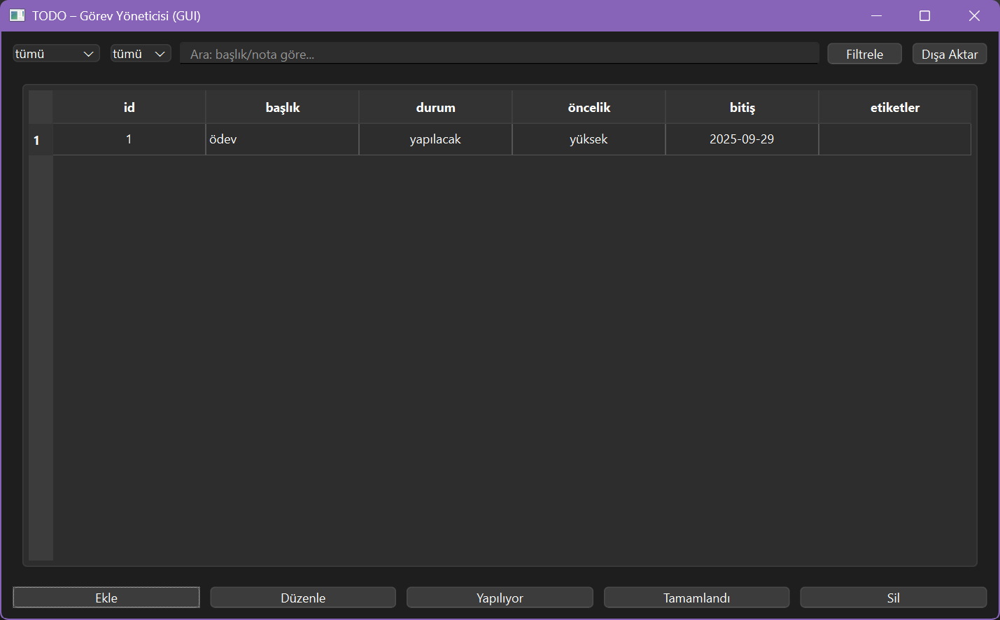

tamamdır ⚡ işte kullanıcı adını **scarlethink** olarak güncellenmiş profesyonel `README.md`:

````markdown
# ✅ Todo-CLI & GUI

**Modern Python CLI + PySide6 GUI görev yönetim uygulaması**

[](https://www.python.org/)
[](https://github.com/scarlethink/todo-cli/actions)
[](LICENSE)

---

## 🚀 Özellikler
- **CLI** (komut satırı) ile görev ekleme, silme, güncelleme
- **GUI** (PySide6) ile görsel görev yönetimi
- Durum yönetimi: `yapılacak`, `yapılıyor`, `tamamlandı`
- Öncelik atama: düşük / orta / yüksek
- Etiketleme (tags)
- Filtreleme & arama
- Görevleri JSON/CSV’ye **export**

---

## 🖼️ Ekran Görüntüsü



> Görseli kendin `docs/screenshot.png` olarak kaydet, README’de otomatik çıkar.

---

## 🔧 Kurulum

### 1. Kodu indir
```bash
git clone https://github.com/scarlethink/todo-cli.git
cd todo-cli
````

### 2. Ortamı kur

```bash
python -m venv .venv
.\.venv\Scripts\activate     # Windows
pip install -r requirements.txt
```

### 3. Çalıştır

**CLI**

```bash
python -m src.todo_cli.cli add "ilk görev" --priority high --tag test
python -m src.todo_cli.cli ls
```

**GUI**

```bash
python -m src.todo_cli.gui
```

---

## 📦 Portable Kullanım

Hazır `.exe` dosyaları **dist/** klasöründe oluşturulabilir:

```bash
pyinstaller ./src/gui.py --name "todo-gui" --windowed --distpath="C:/Users/deyne/OneDrive/Documentos/Proje/todo-cli/dist" --hidden-import=db --hidden-import=models --hidden-import=repository --log-level DEBUG --clean
```

Üretilen dosyalar:

* `dist/todo-gui.exe` → çift tıklayarak GUI
* `dist/todo-cli.exe` → terminalden CLI

---

## 🛠️ Kullanılan Teknolojiler

* **Python 3.12**
* [SQLAlchemy](https://www.sqlalchemy.org/) – veritabanı ORM
* [Typer](https://typer.tiangolo.com/) – CLI framework
* [Rich](https://github.com/Textualize/rich) – renkli terminal
* [PySide6](https://doc.qt.io/qtforpython/) – GUI
* [Pytest](https://docs.pytest.org/) – testler
* GitHub Actions – CI/CD

---

## 📜 Yol Haritası

* [ ] Tekrarlayan görevler
* [ ] Doğal dil tarih desteği (“yarın”, “haftaya” gibi)
* [ ] Görev hatırlatıcı bildirimler
* [ ] Web tabanlı arayüz

---

## 🤝 Katkı

Pull request’ler açıktır. Büyük değişikliklerde önce issue açmanız tavsiye edilir.
Lütfen uygun testleri ekleyin.

---

## 📄 Lisans

[MIT](LICENSE) © 2025 scarlethink


